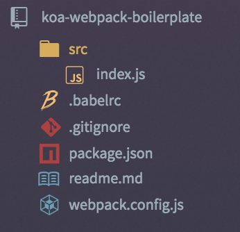
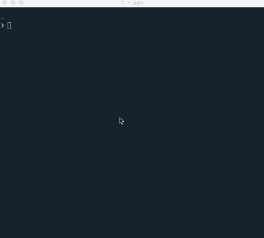
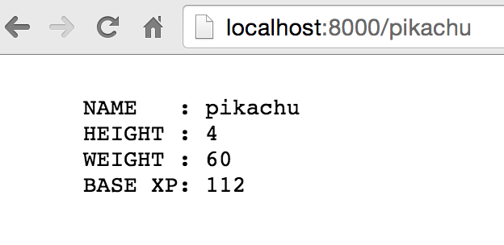
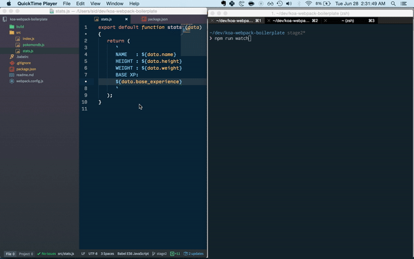

 {.full-width}

#### Yet Another JavaScript Framework?

[Node.js](https://nodejs.org/en/about/) itself offers a
[http](https://nodejs.org/docs/latest/doc/api/http.html#http_http) module which
exposes methods that facilitate creating HTTP clients and servers. However, in
order to support the full spectrum of possible HTTP applications, Node.js’ HTTP
API is very low-level. This is where frameworks like
[Express](http://expressjs.com/), [Hapi](http://hapijs.com/),
[Restify](http://restify.com/), and [Koa](http://koajs.com/) come in.

#### Quick Word on Express

Express is undoubtedly the most popular Node.js application framework in use
today. A quick check reveals that 10434 packages on
[npm](https://www.npmjs.com/) list Express as a dependency. This number probably
increases by the day. The initial commit for Express was made in 2009 by [TJ
Holowaychuk](https://medium.com/u/bbb3c7ccb0a0) and 660 commits later, version
0.0.1 was released. Express ownership was transferred to StrongLoop, in 2014,
which eventually got acquired by IBM. The current lead maintainer of the project
[did not have many nice things to
say](https://github.com/expressjs/express/issues/2844#issuecomment-173758490)
about StrongLoop/IBM.

#### Aloha Koa

The initial commit for Koa was 3 years ago, by none other than the man himself —
[TJ Holowaychuk](https://medium.com/u/bbb3c7ccb0a0). He described it back then
as:

> “Expressive middleware for node.js using generators via
> [co](https://github.com/tj/co) to make writing web applications and REST APIs
more enjoyable to write”.

Basically, Koa allows you to do away with the callback pattern and makes
error-handling more efficient. Everything in Koa is middleware which makes
writing code more intuitive and easy (at least for me). Koa accomplished this
with [generators](https://davidwalsh.name/es6-generators) which were
introduced in [ES2015 (ES6)](http://www.ecma-international.org/ecma-262/6.0/).
This can be run natively in Node.js version 0.11+ (with the `--harmony` flag).
As of [version
2.0.0-alpha.1](https://github.com/koajs/koa/blob/v2.x/History.md#200-alpha1--2015-10-22),
however, the codebase was refactored to [async
functions](https://tc39.github.io/ecmascript-asyncawait/) ([ES2016 or
ES7](https://tc39.github.io/ecma262/2016/)) in favor of generators.
Unfortunately, these are [not
supported](https://bugs.chromium.org/p/v8/issues/detail?id=4483) natively in
[V8](https://developers.google.com/v8/) (underlying engine behind the Node.js
runtime) yet.

#### Tools of the Trade

Since Node.js (V8) does not support `async` functions natively, we will use
[Babel](https://babeljs.io/) to transpile them. JavaScript, as a language, is
constantly evolving with new specs and proposals coming out all the time. Babel
allows us to use these features years before they are available everywhere.

> Babel does this by compiling down JavaScript code written with the latest
> standards into a version that will work in today’s environments. This process is
known as source-to-source compiling aka transpiling.

To build our application, we will use the [Webpack](https://webpack.github.io/)
module bundler which provides an infrastructure for building and transforming
modules. It is discussed in detail in the subsequent sections.

#### Talk is Cheap. Show Me the Code.

The final GitHub repository is linked [here](https://github.com/f0rr0/koa-webpack-boilerplate). Before you begin hacking, make sure you have the latest version of Node.js
[installed](https://nodejs.org/en/). I prefer to use
[n](https://github.com/tj/n) to interactively manage Node.js versions. (While
writing this, I discovered that the author of ’n’ is [TJ
Holowaychuk](https://medium.com/u/bbb3c7ccb0a0) yet again.)

```sh
sudo npm cache clean -f
sudo npm install -g n
sudo n latest
```

To use some npm commands without `sudo` you might have to [fix
permissions](https://docs.npmjs.com/getting-started/fixing-npm-permissions).

#### Boilerplate for Boilerplate

We need to set up a minimal NPM package with a `package.json` file, a directory
for source, and certain essential files for our development tools.



Go ahead and clone the final repository to your machine to build the minimal
server from source.

```sh
git clone https://github.com/f0rr0/koa-webpack-boilerplate
cd koa-webpack-boilerplate
npm install
npm run build:prod
npm start
```

If you want to be articulate and follow from scratch, the following GIF will help:


#### Unbundling Webpack

Webpack was authored by JavaScript superhero [Tobias
Koppers](https://github.com/sokra). It is used in the
[wild](http://stackshare.io/webpack/in-stacks#/) at Pinterest, Hipmunk,
Soundcloud and Typeform among others. It is different from other build tools
([Grunt](http://gruntjs.com/), [Gulp](http://gulpjs.com/),
[Brunch](http://brunch.io/) etc.), that you might be familiar with, since it
does **more** than watching a path and running tasks on files.

> Webpack roams over your application source code, looking for import/require
> statements, building a dependency graph, and emitting one (or more) *bundles*
for the web ([or other
targets](https://webpack.github.io/docs/configuration.html#target)).


It may seem like you can use webpack with only JavaScript modules but that is
not true. With appropriate webpack
[loaders](https://webpack.github.io/docs/loaders.html), you can bundle any
file-type and pre-process it. Basically, what this means is, you can do the
following in your front-end application with the
[css-loader](https://github.com/webpack/css-loader):

```js
require('css!./styles/main.css');
```

If this does not make you run naked in the streets, then I don’t know what will.
You can even chain loaders to process files on the fly, like so:

```js
require('style!css!sass!./styles/main.sass');
```

This one-liner appropriately parses the SASS file to CSS and injects it into the DOM in a style tag. To learn more about webpack, read [Pete Hunt](https://medium.com/u/3b799f227b58)’s [webpack-howto](https://github.com/petehunt/webpack-howto).

When used from the CLI, webpack looks for a configuration file named `webpack.config.js` in the directory from where webpack was invoked. You can also supply your config file using the `--config` option from the CLI. So let’s install webpack and set up the config file for our repository.

Note — You can view and install specific `dist-tags` for a package on `npm` like so:

```sh
npm view <package-name> dist-tags
npm install <package-name>@<dist-tag>
```

In the root directory of your repository:

```sh
npm install -D webpack@beta
```

This installs webpack as a **development dependency** to your package. Beginning from version 2+, the webpack config file can export a function which returns the configuration. The function is called by the CLI and the value passed via `--env` from the CLI is passed to the configuration function. Our minimal `webpack.config.js` will look like so:

```js
const { resolve } = require('path');
const { dependencies } = require('./package.json');
const BabiliPlugin = require("babili-webpack-plugin");

const nodeModules = {};

Object
    .keys(dependencies)
    .forEach((mod) => {
     nodeModules[mod] = `commonjs ${mod}`;
    });

module.exports = (env = { dev: true }) => ({
    context: resolve(__dirname, './src'),
    entry: {
     server: env.prod ? './index.js' : ['webpack/hot/poll?1000', './index.js']
    },
    target: 'node',
    output: {
     filename: '[name].js',
     path: resolve(__dirname, './build'),
     pathInfo: !env.prod
    },
    devtool: env.prod ? 'source-map' : 'eval',
    module: {
     loaders: [
       {
         test: /\.js$/,
         exclude: /node_modules/,
         loaders: [
           'babel-loader'
         ]
       }
     ]
    },
    plugins: env.prod ? [
      new BabiliPlugin()
    ] : [],
    externals: nodeModules
});
```

The various configuration options are well documented
[here](http://webpack.github.io/docs/configuration.html#configuration-object-content).
I’ll explain a couple of quirks related to a non-browser environment below:

* **externals:** When writing a server and bundling it with webpack, we don’t want our dependencies to be resolved by webpack. Instead, they will become the dependencies of the bundle we generate. To accomplish this, we pull our dependencies from the `package.json` file and prefix them with `commonjs`. The Webpack generated import code for a prefixed fictional dependency named `xyz` will then look like so:

```js
module.exports = require("xyz");
```

To ensure that this behaviour is consistent, install dependencies with the `-S`
or `--save` option.

* **target:** Setting the target for our bundle to *node* compiles our modules to be run in a Node.js like environment. What this does is essentially the same as above. It prepends all native modules available in the current Node.js environment with `commonjs`. Internally, the names of all such modules available to the current process are obtained by:

```sh
process.binding("natives");
```

This returns an object with all the native modules like `dns`, `domain`, `events`, `fs`, `http` etc.

#### Dabble in Babel

Babel is used in the [wild](https://babeljs.io/users/) by the likes of Facebook, Netflix, Airbnb and Yahoo. As mentioned earlier, we will use Babel to transpile our ES6/7 code. This is accomplished from within webpack via the `babel-loader`. Our config looks for files ending in `.js` in the `./src` directory and loads them with `babel-loader`. Before you can use it though, you need to install it:

```sh
npm install -D babel-loader babel-core
```

This installs `babel-loader`, again, as a **development dependency**. `babel-loader` in turn lists `babel-core` as its peer dependency which needs to be installed. This is the babel compiler core which exposes the Node.js API. At a high level, Babel runs in three stages: parsing, transforming, and generation. Out of the box, Babel does not transform anything. It just parses code and spits it out exactly the same. To make Babel transform code, we need to (you guessed it!) install plugins.

If you updated your Node.js installation to the latest version, as mentioned earlier, you’d have probably ended up with 6.2.2+ which supports [96%](http://node.green/) of the ES2015(ES6) features. V8 hasn’t landed [support](https://bugs.chromium.org/p/v8/issues/detail?id=1569) for ES6 native modules yet but Webpack 2+ takes care of that for us. It understands native ES6 modules which are statically analyzable. This helps in getting rid of extraneous exports from our build aka dead code elimination. Webpack accomplishes this with [tree-shaking](http://www.2ality.com/2015/12/webpack-tree-shaking.html). Sweet! So we just need to worry about those *async* functions that Node.js 6.2.2 doesn’t understand.

The plugin we need is [babel-plugin-transform-async-to-generator](http://babeljs.io/docs/plugins/transform-async-to-generator/). The name is more than self-explanatory. Babel can be configured to use these plugins via the `.babelrc` file which lives in the root of our repository. Our tiny `.babelrc` file looks like so:

```json5
{
  "plugins": ["transform-async-to-generator"]
}
```

Obviously, it needs to be installed as a **development dependency** before you
can use it:

```sh
npm install -D babel-plugin-transform-async-to-generator
```

#### Catch ’em All With Koa

With our build tools in place, we can start writing the server finally. As mentioned earlier, Koa is a very minimal framework and does not offer much out of the box. Everything in Koa is middleware and there are quite a few of them. We will be using Koa 2 which can be installed with the `next` dist-tag. Go ahead and install Koa and a couple of middleware like so:

```sh
npm install -S koa@next koa-route@next koa-logger@next
```

For the purpose of this article, we will be mocking a database with the [Pokeapi](https://pokeapi.co/). Since Koa expects `xyz` to return a Promise in all `await xyz` expressions, we will make use of [pokedex-promise-v2](https://github.com/PokeAPI/pokedex-promise-v2) which is simply a Promise based wrapper for the Pokeapi. Install it like so:

```sh
npm install -S pokedex-promise-v2
```

We will abstract our database logic into separate modules. Go ahead and create
two new files in the `./src` directory.

```sh
cd src
touch pokemondb.js stats.js
```

* **pokemondb.js** just exports a function that takes a string as an argument
and returns a Promise.

```js
import Pokedex from 'pokedex-promise-v2';

const P = new Pokedex();

export default function get (pokemon) {
   return P.getPokemonByName(pokemon);
};
```

* **stats.js** also exports a function that takes an object as an argument and
return a string.

```js
export default function stats (data) {
   return (
      `
      NAME   : ${data.name}
      HEIGHT : ${data.height}
      WEIGHT : ${data.weight}
      BASE XP: ${data.base_experience}
      `
   );
}
```

With our mock database and helper method in place, we can go ahead and consume
it in our server. The `index.js` looks like so:

```js
import get from './pokemondb';
import stats from './stats';
import Koa from 'koa';
import route from 'koa-route';
import logger from 'koa-logger';

const getPokemonFromAPI = async (ctx, name) => {
  try {
   const data = await get(name);
   ctx.body = stats(data);
  } catch (err) {
    ctx.throw(404, err.error.detail);
  }
};

const app = new Koa();
app.use(logger())
   .use(route.get('/:name', getPokemonFromAPI))
   .listen(8000);
console.log('Listening on Port 8000');
```

The main point of interest here is the asynchronous `getPokemonFromAPI`
function. If you have done asynchronous programming in JavaScript before, you
must be aware of the [callback pattern and the problems it
brings](http://callbackhell.com/). If that is indeed the case, this function
should make you shed tears of joy. Note how this idiom lets us handle errors
gracefully in a try-catch block.

We will be using some neat npm run scripts to build and start our server.

```sh
'scripts': {
  'clean': 'rm -rf ./build',
  'build:prod': 'npm run clean && `npm bin`/webpack --env.prod',
  'watch': 'npm run clean && `npm bin`/webpack --watch --verbose',
  'start': 'node ./build/server.js'
}
```
Besides `start` and `clean`, which are trivial, we will use `build:prod` to make
a production build by passing `prod` via `--env` as mentioned earlier.

Go ahead and run the following in the root of your repository and open
`localhost:8000` in your browser.

```sh
npm run build:prod
npm start
```

Well, there isn’t much to see because our server returned a 404.


This is understandable since we don’t have a route handler attached to our base
URL: `‘/’`. This prompts Koa to return it’s default 404 message. Go ahead and
fix this by adding that route-handler to our `index.js` file.


Before you can see these changes reflected, you need to build the bundle again.
This is a bummer. We want our bundle to be regenerated every time we make
changes to our source files. Our `watch` script takes care of that by running
Webpack in development mode with the `--watch` option. Webpack will now watch
our files and generate a new bundle when we save changes. Run the `watch` script
like so:

```sh
npm run watch
```

Webpack won’t exit since it keeps watching the files. Open a new shell in the
root of your repository to start the server.

```sh
npm start # in new shell tab
```

If you see an error like:

```sh
Error: listen EADDRINUSE :::8000
```

Make sure you exit all currently running servers (Ctrl+C) before starting a
new one. Refresh your browser and you should see:


We can get stats for any Pokemon by pointing our browser to the respective name
like so:



#### Do You Even HMR?

If you play around with what we have so far, you’ll tend to notice that our workflow is still a little complicated. We need to manually restart our server whenever we make changes since a new bundle is generated. To get past that we may use a process manager ([pm2](http://pm2.keymetrics.io/), [nodemon](http://nodemon.io/), [StrongLoopPM](http://strong-pm.io/)) to watch our files and trigger a webpack build before restarting our server. This definitely removes the hassle of doing it manually. However, it works well if we are not doing anything stateful or don’t care about losing state in our server code. Go ahead and take a look at [Dan Abramov](https://medium.com/u/a3a8af6addc1)’s [react-hot-loader](https://gaearon.github.io/react-hot-loader/) if this doesn’t make sense. Let us leverage Webpack’s [Hot Module Replacement](https://webpack.github.io/docs/hot-module-replacement.html) API to hot patch our server side code. For now, we will restrict ourselves to the development environment.

Note that we are currently using [webpack/hot/poll](https://github.com/webpack/webpack/blob/master/hot/poll.js) which polls the Node.js filestream (`fs`) every 1000 ms. In production we might want to use the more efficient [webpack/hot/signal](https://github.com/webpack/webpack/blob/master/hot/signal.js) which listens on process events to check for updates. Creating a separate directory for the records Webpack will generate should also be a good idea.

The watch script needs to be modified to enable HMR. This can also be done by
using the `HotModuleReplacementPlugin` but don’t use both.

```sh
'watch': 'npm run clean && `npm bin`/webpack --env.dev --watch -- verbose --hot'
```

We don’t need to do much to handle the updated dependencies in our main
`index.js` file since we are using ES6 modules which are static in nature. The
following would suffice:


Go ahead and run the `watch` script followed by the `start` script in another
tab as before. Make changes to the `stats.js` module and refresh your browser to
see them live **without restarting the server**. The GIF below illustrates this
in the terminal:



#### Fin?

HMR is theoretically possible in production but has not been tested enough. It
is better to stick to a process manager when in production. On the development
end too however, we can take it one step further by handling the case where a
hot update fails or aborts. The server should appropriately restart in that
instance. Koa apps can be tested fluently with
[supertest](https://github.com/visionmedia/supertest) which this repository will
implement soon.

Originally :pencil: on [Medium](https://medium.com/@f0rr0/kickback-with-koa-webpack-a51d7e5d7911).
